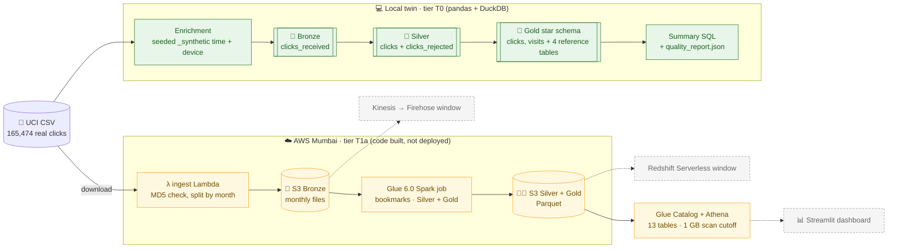

# 🖱️ AWS Clickstream Analytics

## ⚡ Quick Summary

This project turns raw website clicks into answers a shop owner can act on:
how many people visit each day, how deep they browse, and which products make
them leave after one click. It uses **real clickstream data** from a 2008
online clothing shop: 165,474 clicks across 24,026 visits. It is built as a
layered data pipeline (Bronze → Silver → Gold) with data-quality checks at
every step.

The pipeline runs fully on a laptop today (the "local twin", tier T0), and
every count it produces is checked against the real file. The AWS version is
being built in small priced tiers in the Mumbai region: the **Spark job for
AWS Glue and the ingest Lambda are written and tested locally**, and Spark
matches pandas on every one of the 165,474 clicks. Nothing is deployed yet.
Every cloud resource will be torn down after use, so the project costs
nothing per month once it is published.

### Real data, honest labels, and a cloud path priced in rupees before a single resource is created

---

## 🏷️ Project Badges

[-FF9900?style=for-the-badge&logo=amazonwebservices&logoColor=white)](docs/adr/0001-ingest-and-warehouse-stack.md)
[-8C4FFF?style=for-the-badge&logo=amazonwebservices&logoColor=white)](glue/README.md)
[-FF9900?style=for-the-badge&logo=awslambda&logoColor=white)](lambdas/README.md)
[](docs/adr/0004-iac-sam-cloudformation.md)
[](https://spark.apache.org/)
[](https://parquet.apache.org/)

[](https://www.python.org/)
[](https://pandas.pydata.org/)
[](https://duckdb.org/)
[](tests/README.md)
[](https://github.com/deepan-mehta-analytics/aws-clickstream-analytics/actions/workflows/ci.yml)
[](PROJECT-STATUS.md)
[](docs/exam-guide-map.md)
[](LICENSE)

---

## 📌 Project Overview

This project implements **a medallion-architecture clickstream pipeline with a
two-grain star schema**, designed for AWS and built and tested locally first.

It uses the [UCI "Clickstream Data for Online Shopping" dataset](https://archive.ics.uci.edu/dataset/553/clickstream+data+for+online+shopping)
(CC BY 4.0).

**✅ Implemented and verified (tier T0: local twin, no AWS)**

- **Bronze `clicks_received`**: every click as it arrived, including simulated resends
- **Silver `clicks`**: one cleaned row per real click; hard quality rules send failures to `clicks_rejected` with a reason, never silently dropped
- **Gold star schema**: `clicks` (one row per click) and `visits` (one row per visit), plus reference tables `products`, `countries`, `calendar_days`, `devices`
- **Dashboard summaries in portable SQL**: daily visits, browse-depth funnel, bounce rate by product, visits by country and device
- **Labelled synthetic enrichment**: the source has dates but no time of day or device, so these are generated from a fixed seed in columns ending `_synthetic`
- **Reconciliation against measured facts**: a test runs the real file end to end and checks every count against the numbers measured from the source

**🧱 Built and tested locally, not deployed (tier T1a: core lake)**

- **Ingest Lambda**: downloads the UCI file, checks its MD5, splits it by month and lands new months in S3 Bronze, with a retry budget that fits the Lambda timeout
- **Spark Silver and Gold**: the same stages in PySpark 4.1.1 (the Spark version in AWS Glue 6.0), proven equal to pandas on all 165,474 clicks
- **Glue job entry point**: job bookmarks pick up only new Bronze files; monthly lake writes are rerun-safe
- **Library zip**: a build script packages the pipeline code and SQL for the Glue job
- **SAM stack** (`infra/t1-lake`): four private SSE-S3 buckets, the ingest Lambda (reserved concurrency 1), a Glue 6.0 FLEX job with a 15-minute timeout, 13 Glue Catalog tables with partition projection, and an Athena workgroup with a 1 GB scan cutoff, all checked by guardrail tests
- **Owner window and teardown tooling**: PowerShell scripts for the owner to deploy, run and verify the stack, then empty the buckets (versions included) and delete it, confirming the stack is gone; five Athena validation queries; evidence is masked of account IDs, bucket names and emails before it is committed, and compared with the local run's expected counts

**🔜 Planned**

- **T1a deploy**: one owner-run AWS window with the tooling above (Lambda → S3 → Glue → Glue Catalog → Athena), then verified teardown
- **T2**: orchestration, data-quality alerts, monitoring
- **T3 + T4**: one streaming window (Kinesis → Firehose) and one Redshift Serverless window
- **T5**: Streamlit dashboard, local on Athena and published on a snapshot

**🧭 Engineering principles**

- **Research first**: every claim in the original brief is re-verified and logged in [`docs/GAPS.md`](docs/GAPS.md) before adoption
- **Measured results only**: no number is reported unless it came from a real run
- **Decisions on record**: five ADRs (ADR-0005 is proposed) and a cost-tier annex in [`docs/adr/`](docs/adr/)
- **Cost-disciplined and public-safe**: every tier priced in rupees first, torn down after use, placeholders for every account identifier

---

## ⚙️ Tech Stack

| Layer | Tool | Purpose |
|---|---|---|
| 🐍 Language | Python 3.11 | Pipeline code |
| 🐼 Local processing | pandas 2.3 + NumPy | Local twin transformations and seeded enrichment |
| ⚡ Distributed processing | PySpark 4.1.1 (same as AWS Glue 6.0), Java 17/21 | Spark Silver/Gold job for Glue, checked row-for-row against pandas on the full file |
| 🗄️ Storage format | Apache Parquet (pyarrow 16.1) | Columnar files, partitioned by month |
| 🦆 Local SQL engine | DuckDB 1.5 | Runs the summary SQL (the same files are meant for Athena and Redshift) |
| 🕒 Timezones | zoneinfo + tzdata | Shop local time (Europe/Warsaw), stored in UTC |
| 🧪 Testing | pytest 9 | 137 tests on Linux CI, including full-file reconciliation, pandas-vs-Spark parity, template guardrails and the teardown/evidence helpers |
| 🧹 Linting | ruff (Python), cfn-lint (CloudFormation) | Static checks |
| ⚙️ CI | GitHub Actions | Hygiene, lint and tests on every push; downloads the dataset and verifies its MD5 |
| ☁️ Cloud (planned) | AWS Mumbai: Lambda, S3, Glue, Athena, Kinesis, Firehose, Redshift Serverless | See [ADR-0001](docs/adr/0001-ingest-and-warehouse-stack.md) |
| 🏗️ Infrastructure as code | AWS SAM + CloudFormation, `cfn-lint` | One stack per tier, owner-deployed through a reviewed change set ([ADR-0004](docs/adr/0004-iac-sam-cloudformation.md)) |
| 📊 Dashboard (planned) | Streamlit | Local on Athena, published on a data snapshot ([ADR-0002](docs/adr/0002-dashboard-streamlit.md)) |
| 📂 Data | UCI #553 (CC BY 4.0) | Real 2008 clickstream from an online clothing shop |

---

## 🎯 Business Problem

An online shop sees thousands of clicks a day but cannot tell which products
pull visitors deeper into the catalogue and which ones make them leave
straight away. Raw click logs are also messy: events arrive late, arrive
twice, or carry invalid codes.

> **Which products and pages keep visitors browsing, where do visits stop, and
> can those numbers be trusted?**

---

## 🏗️ Architecture



*Green is verified on the full file; amber is written and tested locally but not deployed; dashed nodes are planned tiers.*

| Component | Module | Role |
|---|---|---|
| Source reader | `src/clickstream/source_file.py` | Reads the `;`-delimited UCI file and applies plain column names |
| Enrichment | `src/clickstream/enrichment.py` | `click_id`, `click_time_synthetic`, `device_type_synthetic` |
| Bronze | `src/clickstream/bronze.py` | Adds `received_time`, `data_source`; optional resends |
| Silver | `src/clickstream/silver.py` | Deduplication, hard quality rules, decoding |
| Gold | `src/clickstream/gold.py` | Star schema with click and visit grains |
| Summaries | `sql/summaries/*.sql` + `summaries.py` | Dashboard queries run in DuckDB |
| Runner | `src/clickstream/local_run.py` | End-to-end local run writing Parquet and the report |
| Spark stages | `src/clickstream_spark/` | Source, enrichment, Bronze, Silver, Gold, summaries, quality and lake storage in PySpark |
| Ingest Lambda | `lambdas/ingest_source/handler.py` | Downloads, verifies and lands the UCI file in S3 Bronze by month |
| Glue job | `glue/build_silver_gold.py` | New Bronze files → Silver and Gold, with job bookmarks; Glue 6.0, G.1X × 2 workers, Flex, 15-minute timeout, monthly dynamic partition overwrite |
| Glue Catalog + projection | `infra/t1-lake/template.yaml` | 13 tables defined in the template; Athena partition projection means no crawler and no repair step |
| Athena workgroup | `infra/t1-lake/template.yaml` | Enforced settings, SSE-S3 results that expire after 1 day, 1 GB scan cutoff per query |

| Tier | Scope | Status |
|---|---|---|
| 0 | Research, gaps register, ADRs, cost model | 🔄 ADR-0001 to 0004 accepted, ADR-0005 proposed; a few gaps open |
| T0 | Local twin | ✅ Verified on the full file, 2026-09-25 |
| T1a | Core lake: Lambda → S3 → Glue → Athena | 🔄 Code, SAM stack and owner window/teardown tooling built and tested locally, with public docs and ADR-0005 written (12 of 14 plan tasks); not deployed |
| T1b–T1d | Iceberg Silver, ingest extras, evidence pass | ⏳ |
| T2 | Orchestration, data-quality alerts, monitoring | ⏳ |
| T3 + T4 | Streaming window + Redshift Serverless window | ⏳ |
| T5 | Streamlit dashboard | ⏳ |

Design decisions are recorded as ADRs:
- [ADR-0001: hybrid stack in Mumbai](docs/adr/0001-ingest-and-warehouse-stack.md), with a [cost-tier and SWOT annex](docs/adr/0001-hybrid-cost-tiers.md)
- [ADR-0002: Streamlit dashboard](docs/adr/0002-dashboard-streamlit.md)
- [ADR-0003: data model](docs/adr/0003-data-model.md)
- [ADR-0004: infrastructure as code (SAM + CloudFormation) and security baseline](docs/adr/0004-iac-sam-cloudformation.md)
- [ADR-0005: T1a batch lake design (Spark on Glue, one bucket per layer, projection tables)](docs/adr/0005-t1-batch-lake-design.md), status Proposed

---

## 📁 Repository Structure

```
aws-clickstream-analytics/
│
├── src/clickstream/                 ← pandas pipeline package (local twin, tier T0)
│   ├── source_file.py               ← reads the UCI file, plain column names
│   ├── codebook.py                  ← decodes countries, categories and colours
│   ├── enrichment.py                ← click IDs + seeded _synthetic time and device
│   ├── bronze.py / silver.py / gold.py  ← one module per medallion layer
│   ├── summaries.py / quality.py    ← runs the summary SQL in DuckDB; quality report
│   └── local_run.py                 ← end-to-end run: Parquet + quality_report.json
│
├── src/clickstream_spark/           ← the same stages in PySpark for the Glue job (T1a)
│   ├── source.py / enrichment.py    ← reader and enrichment, equal to pandas
│   ├── bronze.py / silver.py / gold.py  ← medallion layers in Spark
│   ├── summaries.py / quality.py    ← summary SQL and quality counts
│   ├── storage.py                   ← rerun-safe monthly lake writes
│   └── pipeline.py                  ← assembles the whole run
│
├── lambdas/ingest_source/handler.py ← ingest Lambda: download, MD5 check, land by month (not deployed)
├── glue/build_silver_gold.py        ← Glue 6.0 job entry point with bookmarks (not deployed)
├── scripts/build_glue_libs.py       ← builds the library zip the Glue job imports
├── scripts/t1a-*.ps1                ← owner-run T1a window, Glue code upload and verified teardown (never run by CI or agents)
├── scripts/t1a_evidence.py          ← expected counts, evidence masking and comparison for the T1a window
├── sql/validation/t1a/              ← 5 Athena queries that check the deployed lake against expected counts
├── evidence/                        ← masked evidence from owner windows (README only until T1a runs)
├── sql/summaries/                   ← 4 dashboard queries, portable to Athena/Redshift
├── infra/foundation/template.yaml   ← artifacts-bucket stack (owner-deployed only)
├── infra/t1-lake/template.yaml      ← T1a stack: 4 buckets, Lambda, Glue job + catalog, Athena workgroup (not deployed)
│
├── tests/                           ← 137 pytest tests (see tests/README.md)
├── data/README.md                   ← dataset source, licence, MD5s, measured stats (data itself is gitignored)
├── docs/
│   ├── adr/                         ← ADRs 0001–0005 (0005 proposed) + cost-tier annex
│   ├── data-dictionary.md           ← every table and column in plain words
│   ├── cost-model.md                ← verified AWS prices and teardown log
│   ├── exam-guide-map.md            ← DEA-C01 skills-coverage matrix (120 skills)
│   ├── exam-guide-delta.md          ← exam guide re-check log
│   ├── GAPS.md                      ← what is verified, open or accepted as a limitation
│   └── 00-initial-brief.md          ← original non-binding brief
│
├── dashboards/                      ← dashboard tier (T5), README only for now
├── .github/workflows/ci.yml         ← hygiene, lint (ruff + cfn-lint), tests
├── Makefile                         ← working local targets; cloud and T1a owner targets say "owner-run only"
├── pyproject.toml                   ← package and pinned dependencies
├── .env.example                     ← placeholder configuration
├── PROJECT-STATUS.md                ← phase-by-phase status
└── LICENSE                          ← MIT
```

---

## ▶️ How to Run

### 💻 Option 1: Local pipeline (Windows shown; use `.venv/bin/python` on Linux/macOS)

#### 1. Clone and create a virtual environment
```bash
git clone https://github.com/deepan-mehta-analytics/aws-clickstream-analytics.git
cd aws-clickstream-analytics
python -m venv .venv
.venv/Scripts/python -m pip install -e ".[dev]"
```

#### 2. Download the dataset from UCI (see `data/README.md`)
```bash
curl -L -o data/uci553.zip "https://archive.ics.uci.edu/static/public/553/clickstream+data+for+online+shopping.zip"
unzip -o data/uci553.zip -d data/
```

#### 3. Run the pipeline
```bash
.venv/Scripts/python -m clickstream.local_run --source "data/e-shop clothing 2008.csv" --output output/local
```
Output lands in `output/local/` (gitignored): `bronze/`, `silver/`, `gold/`
and `quality_report.json`.

### ⚡ Option 2: Spark tests (the Glue job's code, locally)

```bash
.venv/Scripts/python -m pip install -e ".[dev,spark]"    # adds PySpark 4.1.1 and boto3
.venv/Scripts/python -m pytest tests/test_spark_*.py -v   # needs Java 17 or 21 via SPARK_JAVA_HOME
```
Without Java the Spark tests are skipped with a clear reason. The 4
lake-storage tests are skipped on Windows and run on Linux CI.

### ⚙️ Option 3: CI (GitHub Actions)

Every push runs `.github/workflows/ci.yml`: a **hygiene** job (no secrets or
local-only files tracked) and a **test** job (Python 3.11, Java 17, ruff,
cfn-lint, pytest). It downloads the dataset and checks its MD5 first, so the
full-file and pandas-vs-Spark tests run for real there.

### ☁️ Option 4: Tier T1a on AWS (owner only, not run yet)

Only the account owner runs these steps; no agent or CI job holds AWS
credentials. Nothing below has been run, and every value in angle brackets is
a placeholder. Full detail is in [`infra/README.md`](infra/README.md).

1. Sign in for the window only: `aws login --region ap-south-1`.
2. Deploy the foundation stack once (`aws cloudformation deploy` of
   `infra/foundation/template.yaml`) and note its `ArtifactsBucketName` output.
   Copy that value into your local, gitignored `infra/samconfig.toml` (start
   from `infra/samconfig.example.toml`); `sam deploy --config-env t1-lake`
   reads it.
3. Upload the Glue code: `pwsh scripts/t1a-upload-glue-code.ps1 -ArtifactsBucket <ArtifactsBucketName>`.
4. Build and create a change set only: `sam build`, then
   `sam deploy --config-env t1-lake --template-file .aws-sam/t1-lake/template.yaml --no-execute-changeset`
   (run inside `infra/`).
5. Review the change set in the CloudFormation console, IAM resources first,
   then execute that change set from the console.
6. Run the proof window: `pwsh scripts/t1a-window.ps1`. It ingests April to
   July, runs Glue, ingests August alone to prove the bookmark, runs Glue
   again, runs the five Athena validation queries and saves masked evidence.
7. Tear down: `pwsh scripts/t1a-teardown.ps1`. It empties the buckets,
   deletes the stack and verifies it is gone.
8. Sign out: `aws logout`, and record the window in the teardown log in
   [`docs/cost-model.md`](docs/cost-model.md).

---

## 🧪 Tests

```bash
.venv/Scripts/python -m ruff check src tests lambdas scripts glue
.venv/Scripts/python -m pytest -v        # → 137 passed on Linux CI (133 run, 4 skipped on Windows)
.venv/Scripts/cfn-lint
```

The Spark tests need a JDK (Java 17 or 21); point `SPARK_JAVA_HOME` at it, or
they are skipped with a reason. The 4 lake-storage tests are skipped on
Windows and run on Linux CI.

| File | What it covers |
|---|---|
| `test_source_file.py`, `test_codebook.py` | Reader, plain column names, codebook sizes and labels |
| `test_enrichment.py` | Repeatable seeded enrichment, including a 195-click visit near midnight and DST-safe time conversion (missing and ambiguous local times) |
| `test_bronze.py` | Arrival columns and simulated resends |
| `test_silver.py` | Every Silver quality rule, plus out-of-order and empty input |
| `test_gold.py` | Gold metrics, including the real A18 category anomaly |
| `test_summaries.py`, `test_local_run.py` | The SQL summaries and the end-to-end local run |
| `test_full_file.py` | The real file against the measured stats (skipped when the dataset is not downloaded) |
| `test_infra_templates.py` | Every CloudFormation template: encryption, private buckets, TLS-only policies, safe IAM, no account IDs in any committed file |
| `test_t1_lake_template.py` | T1a stack: parameters, outputs, Glue arguments, logging, table columns vs the code, partition projection |
| `test_ingest_source.py` | Ingest Lambda: month split, MD5 check, retries within the Lambda timeout, skip already-landed months |
| `test_spark_session.py` | Local Spark session uses the same settings as the AWS Glue 6.0 job |
| `test_spark_source.py`, `test_spark_silver.py`, `test_spark_gold.py`, `test_spark_pipeline.py` | Each Spark stage matches its pandas twin |
| `test_spark_full_file.py` | Spark and pandas give identical Silver `clicks` and Gold `visits` on all 165,474 clicks |
| `test_spark_storage.py` | Monthly lake writes, reruns without duplicates, runs with no new files, all-rejected months (skipped on Windows) |
| `test_t1a_evidence.py` | Evidence masking (account IDs, bucket names, emails), expected counts, and the match/mismatch comparison and its exit codes |
| `test_glue_packaging.py` | Library zip contents and the Glue entry point's bookmark handling |
| `test_package.py` | Package metadata |

File-by-file detail is in [`tests/README.md`](tests/README.md).

---

## 📊 Results / Performance

> **Tier T0 verified on the full UCI file, 2026-09-25**, from a local run.
> Tier T1a's Spark code was checked against it on 2026-09-28. No AWS metric
> exists yet; none is reported until measured from a real cloud run.

### ✅ Correctness: every count matched the measured source

| Check | Expected (measured from the file) | Pipeline |
|---|---|---|
| Source clicks read | 165,474 | ✅ 165,474 |
| Clicks rejected by quality rules | 0 | ✅ 0 |
| Silver clicks | 165,474 | ✅ 165,474 |
| Visits | 24,026 | ✅ 24,026 |
| One-click visits (bounces) | 5,042 (≈ 21%) | ✅ 5,042 |
| Category mismatches reported | 1 (product A18: 937× trousers, 1× skirts) | ✅ 1 |
| 🔁 Simulated resends removed (every 1,000th click sent twice) | 166 | ✅ 166 |
| ⚡ Spark vs pandas on the full file: Silver `clicks` and Gold `visits` | identical | ✅ identical |

### 🧭 Browse-depth funnel (visits reaching at least each shop page)

| Page 1 | Page 2 | Page 3 | Page 4 | Page 5 |
|---|---|---|---|---|
| 24,026 | 14,504 | 9,125 | 4,779 | 1,631 |

### ⏱️ Runtimes (single runs, not averages)

| Run | What it did | Duration |
|---|---|---|
| `test_spark_full_file.py` on a laptop | full pandas and Spark runs on 165,474 clicks, then compare | 50.6 s |
| Full test suite on GitHub Actions | 108–137 tests incl. dataset-backed and Spark tests | 67.8 s – 123.9 s |

💰 **Cloud cost (estimate, not measured):** about ₹110 one-time for the full
hybrid build if the Redshift Serverless trial applies, and ₹0/month after
teardown. Details in the [cost-tier annex](docs/adr/0001-hybrid-cost-tiers.md).
Tier T1a alone is estimated at about ₹12 per proof run (an estimate from the
annex, not measured).

---

## 🎓 Exam Alignment

This repo doubles as verifiable skills coverage for the **AWS Certified Data
Engineer – Associate (DEA-C01)** exam guide v1.1: **8 of 120 skills are
shown** (by the local run and tests), **15 are designed** in ADRs, and **97
are not started**. See the full breakdown in
[`docs/exam-guide-map.md`](docs/exam-guide-map.md). This is a skills coverage
map, not exam prep, and it is honest by construction: nothing is marked shown
without a real run behind it.

---

## ⚠️ Known Limitations

- **No user ID in the source**: the pipeline counts **visits**, not active users
- **No checkout or purchase events**: the funnel is a **browse-depth** funnel, not a purchase funnel
- **Time of day and device are synthetic**: generated from a fixed seed, and labelled `_synthetic` everywhere
- **The data is from 2008** (April–August), mostly Polish traffic (≈ 81%)
- **No AWS resources exist yet**: the cloud tiers are designed and priced; the T1a Lambda and Glue code is tested locally only, never run on AWS
- **Infrastructure as code is written but not deployed**: AWS SAM-extended CloudFormation, one stack per tier, deployed only by the account owner ([ADR-0004](docs/adr/0004-iac-sam-cloudformation.md)). The foundation (artifacts bucket) and T1a lake templates exist and pass cfn-lint and guardrail tests; neither has been deployed
- **Encryption uses S3-managed keys (SSE-S3), not a customer-managed KMS key**, to avoid a monthly key charge and a 7–30 day key-deletion wait ([ADR-0004](docs/adr/0004-iac-sam-cloudformation.md))
- **Spark is used for exam coverage and learning, not because the data needs it**: 165,474 rows would normally be Athena SQL or plain Python. An enterprise team would write each transform once, with no pandas copy ([ADR-0005](docs/adr/0005-t1-batch-lake-design.md))
- **Glue Flex runs can start late**: Flex uses spare capacity, so a run's wait time is not predictable
- **T1a has not run on AWS yet**: Glue 6.0 in Mumbai is inferred from a price-list entry, and the Glue role's permission set and minimum worker count are unverified until the first window ([`docs/GAPS.md`](docs/GAPS.md))
- **Single runs only**: runtimes above are one run each, not averages

---

## 🔜 Roadmap

- [x] T0: local twin (Bronze → Silver → Gold → summaries, verified on the full file)
- [ ] T1a: core lake on AWS Mumbai (Lambda → S3 → Glue → Athena): code, SAM stack and owner tooling built and tested locally, 12 of 14 plan tasks done
- [ ] T1b–T1d: Iceberg Silver, ingest extras, evidence pass
- [ ] T2: orchestration, data-quality alerts, monitoring
- [ ] T3 + T4: one streaming window (Kinesis → Firehose) with a Redshift Serverless window
- [ ] T5: Streamlit dashboard, local on Athena and published on a snapshot
- [x] DEA-C01 skills-coverage map

---

## 📂 Dataset

**[Clickstream Data for Online Shopping](https://archive.ics.uci.edu/dataset/553/clickstream+data+for+online+shopping)**,
UCI Machine Learning Repository #553 (DOI 10.24432/C5QK7X) · licence
**CC BY 4.0**.

| Property | Value (verified from the downloaded file, 2026-09-25) |
|---|---|
| Rows (clicks) | 165,474; 14 columns; 0 nulls; 0 duplicate rows |
| Visits (sessions) | 24,026; median 4 clicks, longest 195 |
| Dates | 135 days, 2008-04-01 to 2008-08-13 |
| Countries | 47 codes; Poland ≈ 81% of clicks |
| Catalogue | 4 categories, 217 products, 14 colours, shop pages 1–5 |

⚠️ There is no time of day, user ID, device or purchase event in the source,
so metrics are named for what they really measure (ADR-0003). Checksums and
the full measured statistics are in [`data/README.md`](data/README.md).

Łapczyński M., Białowąs S. (2013). *Discovering Patterns of Users' Behaviour
in an E-shop – Comparison of Consumer Buying Behaviours in Poland and Other
European Countries.* Studia Ekonomiczne, nr 151, pp. 144–153.

---

## 📜 License

Released under the MIT License. See [`LICENSE`](LICENSE). The dataset keeps
its own licence (CC BY 4.0).

---

## 👤 Author

**Deepan Mehta**

- Data Analytics → Data Engineering → AI/ML Engineering
- Focused on building end-to-end data and ML systems combining analytics, automation, and deployment
- Experience in ETL pipelines, predictive modelling, and analytical databases

🔗 GitHub: [deepan-mehta-analytics](https://github.com/deepan-mehta-analytics)
